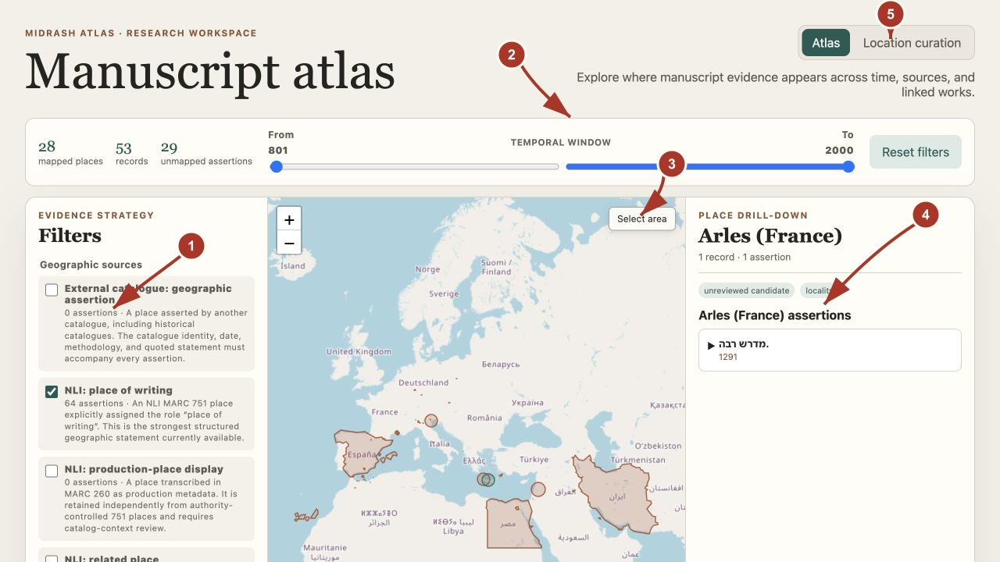
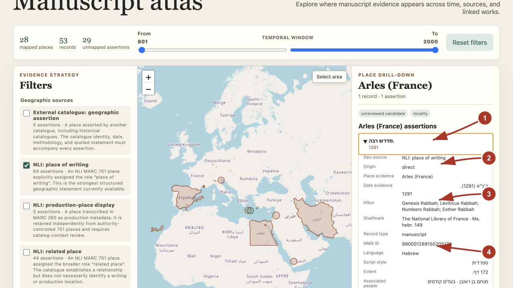
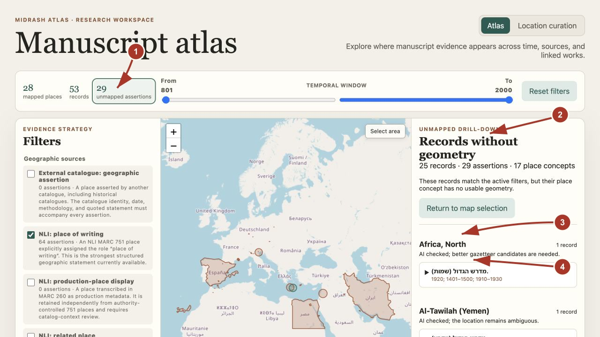
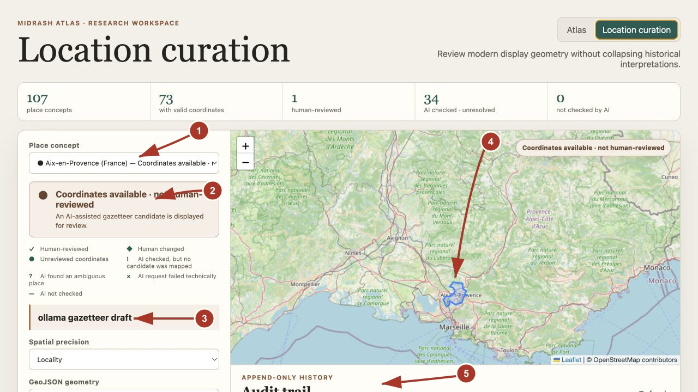

# Midrash Atlas feature tour

This guide shows the current PoC interface, captured on 2026-07-28. Dataset
counts will change as curation progresses. The numbers in each screenshot
correspond to the explanations immediately below it.

## Atlas workspace

1. **Evidence filters** independently enable geographic source types. Additional
   controls lower in the rail filter parent/child origin, Hibur, geometry review
   state, undated records, and the `circa` display policy.
2. **Temporal window** filters events by their policy-derived effective
   interval. The stored assertion remains unchanged.
3. **Spatial selection** activates a bounding-box tool. Its drill-down combines
   records from every mapped geometry intersecting the selected area.
4. **Place drill-down** shows records attached to the selected geometry,
   including records on geometries spatially contained by it. Opening a record
   reveals its date, Hibur, shelfmark, catalog metadata, links, and a collapsed
   MARC-provenance section.
5. **Workspace switcher** moves between atlas exploration and location
   curation.

When several geographic sources are enabled, one manuscript may participate in
several assertion events. If they resolve to different places, the manuscript
appears in each relevant place drill-down. If they resolve to the same place,
the place reports one record and multiple assertions.

## Manuscript drill-down

1. **Manuscript header** uses the target record's primary NLI title and shows
   all applicable catalog date assertions.
2. **Geographic evidence** identifies the enabled source layer, parent/child
   origin, and unmodified place statement.
3. **Temporal and conceptual links** retain every matching date assertion and
   the many-to-many Hibur relationships.
4. **Descriptive metadata** includes shelfmark, record identifiers, language,
   script, extent, contributors, owners, notes, colophon, and catalog-update
   time when present. MARC field mappings are kept in the collapsed **Catalog
   field provenance** section below the descriptive values.

## Records without geometry

1. **Unmapped assertion count** is clickable and respects the current temporal,
   source, origin, Hibur, and review-state filters.
2. **Dedicated drill-down** keeps these records visible without inventing
   centroids or coordinates.
3. **Resolution status** distinguishes AI-not-checked, ambiguous,
   candidate-missing, unmappable-candidate, and technical-failure states.
4. **Manuscript card** opens the same metadata and evidence view used for mapped
   records.

Unmapped results are grouped by place concept. The heading reports unique
records separately from assertions, so multiple evidence layers do not inflate
the manuscript count.

## Location curation

1. **Alphabetized place selector** exposes coordinate and review status before a
   place is selected.
2. **Status panel and legend** distinguish human-reviewed or human-changed
   geometry, unreviewed coordinates, unresolved AI checks, technical failures,
   and places not yet checked.
3. **Geometry source and editor** show how the current `modern_place` display
   geometry was produced. Curators can edit its precision and GeoJSON and mark
   it reviewed by a human.
4. **Map preview** displays the exact point, polygon, or multipolygon that will
   be saved.
   Smaller contained geometries render above broader ones in the atlas.
5. **Append-only audit trail** records revisions, timestamps, review actions,
   change reasons, and the AI provider/model when a draft informed the change.

The gazetteer and LLM assist curation only. Atlas rendering reads persisted
geometry and never performs runtime geocoding. An AI rerun may replace the
current AI draft, but it appends an audit entry and never overwrites a
human-saved geometry revision.

## Parent-derived evidence

Each assertion records both the manuscript record being mapped and the MARC
record that supplied the evidence:

- `direct`: the target record itself contains the source field.
- `parent_fallback`: the parent supplies that source type because the child has
  no equivalent.
- `parent_alternative`: both child and parent supply that source type, so both
  assertions remain available.

These labels describe provenance, not confidence or correctness.
